<p align="center">
  <picture>
    <source media="(prefers-color-scheme: dark)" srcset="readme/logo-dark.svg">
    
  </picture>
</p>

<h1 align="center">wh</h1>

<p align="center">Tiny git companion. Worktrees, minus the ceremony. History, diffs, and pull requests in plain English: in the terminal, or in the browser for any GitHub repo.</p>

<p align="center">
  <a href="https://github.com/chrispetrou/wh/actions/workflows/ci.yml"></a>
  <a href="https://github.com/chrispetrou/wh/releases"></a>
  
  
  <a href="LICENSE"></a>
  
  
</p>

**wh** is a git companion with two surfaces. The cli manages worktrees so
branch-switching never touches your working state, and explains diffs in
plain English so review starts with understanding, not archaeology. The web
app is a terminal for any repo you can see on GitHub, cloned or not: what
changed, the commit graph, pull requests, a file's history, why a line
exists, and rebase or cherry-pick plans written out as commands to paste.
Nothing is ever written to the repo or to GitHub.

Local-first and telemetry-free. Explanations run on your own key (Anthropic,
OpenAI, Groq's free tier) or, in the cli, a local model via Ollama. The cli
needs nothing but git; the web needs a GitHub sign-in and keys that stay in
your browser.

Written in Rust and TypeScript. The cli is one binary (0.6MiB, budget
3.2MiB), two dependencies (clap, serde_json), no runtime. The web app is a
Next.js app you run yourself. One explain spec (`shared/prompts/`) sits
behind both, so an answer reads the same wherever you ask.

## install

```
cargo install --path cli                                   # from a clone
cargo install --git https://github.com/chrispetrou/wh wh   # or straight from git
```

That puts `wh` in `~/.cargo/bin`. Add the shell wrapper so `wh switch` can
actually change directory:

```
echo 'eval "$(wh init zsh)"' >> ~/.zshrc     # bash: ~/.bashrc
wh init fish | source                        # fish: add to config.fish
```

Needs `git`, and `curl` for `wh explain` (both ship with macOS and virtually
every Linux). Tagged releases build static binaries for macOS (arm64, x64)
and Linux (x64, arm64 musl) with sha256 checksums; a `curl | bash` installer
comes with the first release.

## quick start

```
wh new feat/auth              # a sibling worktree, branch created if missing
wh ls                         # every worktree, dirty count, ahead/behind
wh switch                     # pick one, cd into it
export GROQ_API_KEY=gsk_...   # free tier at console.groq.com
wh explain HEAD~3..           # the last three commits, in plain english
wh rm                         # prune worktrees whose branches are merged
```

## cli commands

| command | what it does |
|---|---|
| `wh new <branch> [--from <ref>]` | create a worktree in a sibling dir, copy `.env*` files into it |
| `wh ls` | list worktrees with dirty count and ahead/behind |
| `wh switch [query]` | pick a worktree (or match one) and cd into it |
| `wh rm [name] [--dry-run] [--yes] [--force]` | remove merged worktrees, or one by name |
| `wh explain [range] [--uncommitted] [--changelog] [--describe] [--chat] [--dry-run] [-- <pathspec>]` | a plain-English review, release notes, or a pr draft for a diff |
| `wh why <path>:<line> [--chat] [--dry-run]` | why a line exists: git blame, then the commit that last touched it |
| `wh init <zsh\|bash\|fish>` | print the shell wrapper that makes `switch` a real `cd` |

`--help` on any of them is short and lowercase. Colors only when the output
is a terminal and `NO_COLOR` is unset. Exit codes: 0 success (including a
declined prompt), 1 for any error or a cancelled picker, 2 for bad usage.

### wh new

<picture>
  <source media="(prefers-color-scheme: dark)" srcset="readme/new-dark.svg">
  
</picture>

The worktree lands next to the main one as `<repo>.<branch>` (`/` and other
unsafe characters become `-`), anchored to the main worktree, never to
wherever you are standing. The branch is created from `HEAD` if it does not
exist; `--from <ref>` branches from elsewhere. Top-level `.env` and `.env.*`
files are copied over (not `.envrc`, nothing recursive), skipping any that
already exist; the `copied` line is left out when there was nothing to copy.

```
wh new fix/nav-323                  # ../repo.fix-nav-323, from HEAD
wh new hotfix/1.2 --from v1.2       # branch from a tag
wh new feat/auth                    # existing branch: just checks it out
```

Refuses with a one-line reason when the directory exists or the branch is
already checked out somewhere.

### wh ls

<picture>
  <source media="(prefers-color-scheme: dark)" srcset="readme/ls-dark.svg">
  
</picture>

Main worktree first, then alphabetical. Status is `clean`, `N dirty`, or
`stale` (a worktree git can no longer read, or one it would prune); the
muted column is `ahead N`, `behind N`, or both, against the upstream. A
detached worktree shows as `<sha> detached`.

### wh switch

<picture>
  <source media="(prefers-color-scheme: dark)" srcset="readme/switch-dark.svg">
  
</picture>

Type to filter, arrows (or ctrl-p/ctrl-n) to move, enter to select, esc to
cancel. The picker draws on `/dev/tty` and prints only the chosen path to
stdout, which is what the `wh init` wrapper turns into a `cd`. Without the
wrapper, `cd "$(wh switch)"` does the same.

```
wh switch auth        # unique match: no picker, straight there
wh switch fix         # 'fix' matches 2 worktrees: lists them, exit 1
wh switch             # no terminal (a script, a pipe): asks for a query
```

An exact name wins over a substring match.

### wh rm

<picture>
  <source media="(prefers-color-scheme: dark)" srcset="readme/rm-dark.svg">
  
</picture>

With no name, `wh rm` prunes worktrees whose branches are merged into the
default branch and deletes those branches. It never touches dirty, locked,
or detached worktrees, the main worktree, or the one you are standing in;
`nothing to prune` when there is nothing to do.

```
wh rm --dry-run                   # preview only
wh rm --yes                       # no prompt (required when not a terminal)
wh rm feat/auth                   # one worktree, by branch or directory
wh rm feat/auth --force           # even if dirty or unmerged
```

Merged means the branch is an ancestor of the default branch, every one of
its commits has an equivalent patch there (a rebase merge), or its whole
tree landed as a single commit (a squash merge). `--force` is for dirty or
genuinely unmerged worktrees; it needs a name. Named removals print
`removed <path> (<branch>)` and no summary line.

### wh explain

<picture>
  <source media="(prefers-color-scheme: dark)" srcset="readme/explain-dark.svg">
  
</picture>

Reads a diff, preprocesses it (lockfiles, vendored paths, minified and
binary files are dropped; big diffs are capped per file and in total, per
`shared/prompts/`), and streams the model's answer: a `summary`, then a
`watch out` section. The closing line is elapsed time, model, and token cost
when the provider reports it.

Three modes, one diff:

| mode | asks for | sections |
|---|---|---|
| (default) | a review | `summary`, `watch out` |
| `--changelog` | release notes, one line per user-visible change | `added`, `changed`, `fixed`, `removed` (empty ones left out) |
| `--describe` | a pull request to paste | `title` (in the repo's own subject style), `description`, `testing` when the diff shows how to verify |

<picture>
  <source media="(prefers-color-scheme: dark)" srcset="readme/changelog-dark.svg">
  
</picture>

<picture>
  <source media="(prefers-color-scheme: dark)" srcset="readme/describe-dark.svg">
  
</picture>

Ranges:

```
wh explain                          # HEAD~1.. (the last commit)
wh explain HEAD~3..                 # the last three
wh explain main..dev                # two-dot: exactly what git diff gets
wh explain main...dev               # three-dot: from the merge base, log walks dev only
wh explain v1.2                     # a bare ref means v1.2..HEAD
wh explain abc123~1..abc123         # one commit
wh explain --changelog v1.1..v1.2   # notes for a tag
wh explain --changelog v1.2.. > notes.md
wh explain --describe               # current branch vs the default branch, main...HEAD
wh explain --describe > body.md
wh explain --dry-run HEAD~3..       # the payload the model would see, no call
wh explain --uncommitted            # work you have not committed yet
wh explain HEAD~5.. -- src/         # cut any of them to a pathspec
```

`--uncommitted` is `git diff HEAD`: staged and unstaged together, the
change you are about to commit. It takes no range, and there is no
`commits:` block in the payload because there are no commits yet.
Untracked files are not in a diff until you `git add` them.

Anything after `--` is a git pathspec, passed to the diff and to the
commit list, so `wh explain HEAD~5.. -- src/` reviews only what happened
under `src/`.

`--describe` with no range compares against the default branch from their
merge base, so a base that moved on never leaks into the draft, and tells
the model the branch names (`branch feat/auth into main`); a bare ref there
means `<ref>...HEAD`. Nothing is written to GitHub.

`--chat` keeps the conversation open after the answer: a `?` prompt takes
follow-up questions about the same diff, grounded in what the model has
already seen, so a second question costs no second diff. An empty line or
ctrl-d ends it; there is no history beyond what your terminal gives a
line of input. It needs a terminal on both ends, and quietly stays a
one-shot when either is a pipe. It cannot be combined with `--dry-run`.

When stdout is not a terminal the two muted status lines go to stderr, so
redirecting to a file holds only the answer. `--changelog` and `--describe`
are mutually exclusive.

### wh why

```
wh why src/git.rs:42        # why that line exists
wh why src/git.rs:13-17     # a span
wh why src/git.rs:42 --chat # then keep asking
```

`git blame` says who and when; this says why. The line is blamed locally,
the commit that last touched it becomes the payload cut to that file, and
the answer is a `why` section then `watch out`. The status line names the
blaming commit, and a span says how many other commits touch it. A line
you have not committed yet says so instead of guessing.

### wh init

`wh init zsh` (or `bash`, `fish`) prints a small `wh()` function that
forwards every command and turns `wh switch` into a `cd`. Nothing is
written; you `eval` it from your rc file.

<picture>
  <source media="(prefers-color-scheme: dark)" srcset="readme/init-dark.svg">
  
</picture>

## configuration (explain)

Environment only, no config files:

```
ANTHROPIC_API_KEY   used if set (model: claude-opus-5)
OPENAI_API_KEY      used if no anthropic key (model: gpt-5.6-terra)
GROQ_API_KEY        used if neither (model: openai/gpt-oss-120b)
                    none set: local ollama (model: llama3.2)
WH_PROVIDER         force one of: anthropic, openai, groq, ollama
WH_MODEL            override the model for any provider
WH_OLLAMA_URL       default http://localhost:11434
WH_GROQ_URL         default https://api.groq.com/openai
WH_OPENAI_URL       default https://api.openai.com
WH_ANTHROPIC_URL    default https://api.anthropic.com
NO_COLOR            any value disables color
```

Paid keys win the auto-detect so nobody is silently downgraded;
`WH_PROVIDER=groq` opts into the free tier, `WH_PROVIDER=ollama` into the
no-key option. The `WH_*_URL` variables point at any compatible gateway.

Requests go through the system `curl`; the key travels in curl's config on
stdin (never argv) and the request body sits in a `0600` temp file for the
duration of the call. Nothing is sent anywhere unless you run `wh explain`.

### when a call fails

One line under an amber `error:` label, in plain words, never the
provider's json, with the way out on the line below where there is one:

```
provider rejected the key                          set GROQ_API_KEY to a valid key
your groq key is out of credit                     top up at console.groq.com/settings/billing
your openai key hit its spend limit                raise it at platform.openai.com/...
provider rate limit, try again in 12s
provider daily limit reached, resets in 3h 12m
the diff is too big for gpt-5-mini: 17842 tokens, limit 8192
provider has no model gpt-6
provider is overloaded, try again in a moment
could not reach api.groq.com
lost the connection to api.groq.com
```

A key nearly out of headroom gets an amber warning after the answer (`low on
groq tokens: 8.2k of 100k left, resets in 42s`). The wording is a shared
contract in `shared/prompts/provider.md`.

## web

`web/` is a terminal for any GitHub repo, in the browser: sign in with
GitHub, pick a repo, ask in plain words. It explains everything the cli
explains, and answers the things only a hosted repo can: pull requests, the
commit graph, who did what since when, a file's story, why a line exists.
It also lays out rebase and cherry-pick plans as git commands to paste;
nothing is ever executed or written to GitHub. No worktrees (those are
local by nature).

### run it

Node 22 (see `web/.nvmrc`):

```
cd web
npm install
npm run dev
```

Open http://localhost:3000. The first run shows a one-time setup screen that
links to a prefilled GitHub OAuth-app form and saves the client id and
secret to `web/.env.local` for you. Sign-in asks for the `repo` scope so
private repos appear in the picker (GitHub has no read-only scope for
private repos; wh only ever reads). Hosting it somewhere (env-only
config, an optional sign-in allowlist, a dockerfile), sessions, and the
api limits are in [web/README.md](web/README.md).

### commands

Phrasing is flexible: `explain`, `summarize`, `show me`, `what changed in`
work as leading verbs, a trailing `?` is fine, and cli-style input (`wh
explain HEAD~3..`) works verbatim. Wherever a branch, tag, pr number, or
log row belongs, a completion menu drops down, filtered as you type.

<picture>
  <source media="(prefers-color-scheme: dark)" srcset="readme/web-pr-dark.svg">
  
</picture>

| ask | examples |
|---|---|
| a diff range | `diff main..release`, `compare v1.1..v1.2`, `main..` (to the default tip), `..dev` |
| the last N commits | `explain the last 5 commits`, `last 3 on feat/auth`, `HEAD~3..` |
| a pull request | `what changed in pr #42`, `pr 42`, `#42` |
| a branch vs the default | `what changed in feat/auth` |
| one commit | `explain <sha>` |
| the graph | `log`, `log 100`, `log on feat/auth`, `log since monday by me` |
| a row of the log | `explain 3`, `explain 2..5` (row 5's parent to row 2) |
| time and people | `since yesterday`, `this week`, `since v1.2 by alice`, `what did i do this week`, `standup` |
| release notes | `changelog v1.1..v1.2`, `changelog since v1.2`, `release notes for pr #42`, `changelog` (since the newest tag) |
| a pr draft | `describe pr #42`, `describe feat/auth`, `draft a pr for feat/auth`, `describe main..dev` |
| a rebase plan | `rebase feat/auth`, `rebase main..feat/auth`, `rebase pr #42`, `rebase 2..5` (log rows) |
| a cherry-pick plan | `pick 3 5 onto release/1.x`, `backport pr #42 to release/1.x` |
| a file's story | `history src/git.rs`, `history src/ on feat/auth` |
| a line or a span | `why src/git.rs:42`, `why src/git.rs:13-17`, `why line 42 of src/git.rs on v1.2` |
| who knows a file | `who src/git.rs`, `who knows src/ on dev` |
| read a file | `view src/git.rs:42`, `cat` works too; click a line number to ask why |
| a listing | `ls`, `ls src on dev` |
| hotspots | `churn`, `churn since v1.2 in src/`, `hotspots on dev` |
| the repo's pulse | `activity`, `activity since this week` |
| cut to a path | any explain plus `in <path>`: `explain the last 5 commits in src/`, `changelog of pr 42 in docs/` |
| lists | `branches`, `tags`, `prs`, `closed prs`, `my prs`, `stale` (quiet branches), `stale 12w` |
| follow-ups | plain words after an explain: `why is that risky?`, `which files touch auth?` |

Periods are plain words: `today`, `yesterday`, `this week`, `last month`,
`last year`, `since monday`, `since 3 days ago`, `since 12w`, `since v1.2`;
`by <login>` keeps one person's commits,
`by me` yours, and `standup` is your commits since the last working day.
`changelog` and `describe` wrap any diff command and produce the same
sections as the cli; `describe pr #42` keeps the pr's own title and body
where the diff still supports them.

### the log, prs, and history

`log` draws the commit graph inside the transcript: lanes, a dot per
commit, branch and tag chips, subject, author, age, sha, every row
numbered. `prs`, `history <path>`, `branches`, and `tags` are lists of the
same kind. All of them are blocks you can walk: arrows move, enter opens a
commit or pr in place (its files with their +/−, and `explain`,
`changelog`, `describe` actions), esc steps back out.

<picture>
  <source media="(prefers-color-scheme: dark)" srcset="readme/web-log-dark.svg">
  
</picture>

### rebase and cherry-pick plans

`rebase feat/auth` (or a range, `pr #42`, `last 5 on feat/auth`, log rows
`2..5`) lists those commits as an editable plan: reorder a row by dragging
it or with shift+up/down, set its action with `p` `r` `s` `f` `d` `e`
(pick, reword, squash, fixup, drop, edit), edit a message inline or let the
model draft one. `pick 3 5 onto release/1.x` (or `backport pr #42 to
release/1.x`) is the same block for a cherry-pick; dragging a row from a
`log` or `prs` block onto a branch starts one too.

Under the rows sits the block to paste: one `git rebase -i` driven by a
todo file, or `git switch` and `git cherry-pick -x`, every name
shell-quoted. Rows whose files also changed on the target are flagged in
amber before you paste. Nothing here runs: the commands run in your local
clone, and you push.

### keys, models, effort

Everything that only reads the repo (log, branches, prs, history, who,
view, the rebase and cherry-pick plans) runs with no key stored. The
first explain without one asks for a key: paste it as a message. Keys
live in your browser only, one per
provider (the prefix decides which), travel per request in a header, and
are never stored, logged, or echoed back by the server.

| provider | default model | effort | free tier |
|---|---|---|---|
| anthropic | claude-opus-5 | low, medium, high, xhigh, max | |
| openai | gpt-5.6-terra | none, minimal, low, medium, high, xhigh, max | |
| groq | openai/gpt-oss-120b | (ignored) | console.groq.com |

`/model` switches models (any id; picking another provider's model makes
that provider active) and `/effort` sets the reasoning effort where the
provider supports it, both remembered per provider. `/usage` shows what
each key has cost since it was saved, in tokens only: the provider's
dashboard is the bill.

### slash commands

Typing `/` opens a menu of all of them with their options.

| command | does |
|---|---|
| `/help`, `/wh` | the web grammar; the cli commands |
| `/repos` | back to the repo picker |
| `/key [value \| clear [provider]]` | add or replace a key, list them, drop one or all |
| `/model [id \| default]`, `/effort [level \| default]` | per provider |
| `/usage [reset [provider]]` | tokens per key |
| `/show` | the raw diff payload the model saw, pager-colored |
| `/copy`, `/export` | last answer to the clipboard; save the transcript as `wh-<owner>-<repo>.txt` |
| `/theme auto\|light\|dark`, `/font default\|fira\|jetbrains\|plex`, `/fontsize 11..18`, `/ligatures on\|off` | looks |
| `/account`, `/info` | who you are; repo, provider, keys, usage, prefs |
| `/stop`, `/clear`, `/logout` | abort a running explain; new transcript; sign out |

Repos open as tabs (ctrl+t, ctrl+1..9), each with its own transcript;
ctrl+r searches history, esc stops a running explain, cmd+k opens the repo
picker. `/help` lists every key; so does [web/README.md](web/README.md).

## terminal or web

Same tool, two surfaces, one explain spec (`shared/prompts/`), so an answer
reads the same wherever you ask.

```
                    terminal (wh)                 web
worktrees           new, ls, switch, rm           (cli only)
explain a range     wh explain main..dev          diff main..dev
last N commits      wh explain HEAD~3..           explain the last 3 commits [on <branch>]
a pull request      fetch the branch, then a range what changed in pr #42
one commit          wh explain <sha>~1..<sha>     explain <sha>
the graph           git log --graph               log, then explain 3
time and people     git log --since, --author     since yesterday by me, standup
release notes       wh explain --changelog v1..   changelog v1.1..v1.2
a pr description    wh explain --describe         describe pr #42, describe <branch>
a file's story      git log -p -- <path>          history <path>
why a line exists   wh why <path>:<line>          why <path>:<line>
rebase, cherry-pick git rebase -i, git cherry-pick rebase <branch>, pick 3 5 onto <branch>
branches            wh ls (worktrees, dirty)      branches (ahead/behind), tags
follow-ups          wh explain --chat             plain words after an explain
uncommitted work    wh explain --uncommitted      (cli only)
cut to a path       wh explain <range> -- src/    any explain plus `in src/`
raw payload         wh explain --dry-run          /show
keys                env: ANTHROPIC_API_KEY, ...   pasted once, kept in browser
providers           anthropic, openai, groq,      anthropic, openai, groq
                    ollama
model / effort      WH_MODEL, WH_PROVIDER         /model, /effort, per provider
private repos       whatever git can reach        github oauth, repo scope
```

Pick the terminal when the diff is local, uncommitted, or on a machine with
no GitHub access, when you want a no-key model via Ollama, or when the job
is worktrees. Pick the web when the repo lives on GitHub and you want to ask
about a pr or a branch without cloning it, keep several repos open as tabs,
or want the log graph, the pr list, and the rebase plans to walk. Keys
never cross between the two.

## layout

```
cli/     rust cli: the wh binary
web/     next.js app: the web terminal
site/    landing page
shared/  explain spec: prompt template, preprocessing rules, provider
         wording, and golden fixtures both implementations must reproduce
readme/  the logo and the animated svgs embedded above (see scripts/readme-anim.mjs)
```

`shared/` is spec once, implement twice: change the spec first, then both
implementations, and the golden fixtures under `shared/fixtures/` must be
reproduced byte for byte by the Rust and the TypeScript preprocessors.

## building

```
cd cli && cargo build --release   # binary at target/release/wh
cd cli && cargo test              # unit + integration (isolated git config)
cd web && npm test                # vitest: grammar, preprocessing, providers, usage
cd web && npm run build
node scripts/readme-anim.mjs      # regenerate the readme animations
```

CI runs fmt, clippy, tests, a 3.2MiB size gate on the binary, the web tests
and build, and a brand check (no em dashes outside the landing mock).
Tagged releases (`v*`) build the four static binaries and open a draft
GitHub release with checksums. The animations above are plain animated svgs
(css keyframes, no gif, no javascript) written by `scripts/readme-anim.mjs`;
wording and pacing live in that script, not in the svg files.

GPL-3.0 license.
