<p align="center">
  <picture>
    <source media="(prefers-color-scheme: dark)" srcset="readme/logo-dark.svg">
    
  </picture>
</p>

<h1 align="center">wh</h1>

<p align="center">Tiny git companion. Worktrees, minus the ceremony. History, diffs, and pull requests in plain English: in the terminal, or in the browser for any GitHub repo.</p>

<p align="center">
  <a href="https://github.com/chrispetrou/wh/actions/workflows/ci.yml"></a>
  <a href="https://github.com/chrispetrou/wh/releases"></a>
  
  
  <a href="LICENSE"></a>
  
  
</p>

<p align="center"><a href="https://getwh.dev/docs">documentation</a> · <a href="https://getwh.dev">site</a></p>

<p align="center">
  
</p>

**wh** has two surfaces. The cli manages worktrees so branch-switching never
touches your working state, and explains diffs in plain English. The web app
is a terminal for any repo you can see on GitHub, cloned or not: what changed,
the commit graph, pull requests, a file's history, why a line exists, and
rebase or cherry-pick plans written out as commands to paste. Nothing is ever
written to the repo or to GitHub.

Local-first and telemetry-free. Explanations run on your own key (Anthropic,
OpenAI, Groq's free tier) or, in the cli, a local model via Ollama. The cli is
one Rust binary (0.6MiB, budget 3.2MiB) with three small dependencies (clap,
serde, serde_json) and no runtime; the web app is a Next.js app you run
yourself. One explain spec (`shared/prompts/`) sits behind both, so an answer
reads the same wherever you ask.

## install

```
cargo install --path cli                                   # from a clone
cargo install --git https://github.com/chrispetrou/wh wh   # or straight from git
```

Add the shell wrapper so `wh switch` can actually change directory:

```
echo 'eval "$(wh init zsh)"' >> ~/.zshrc     # bash: ~/.bashrc
wh init fish | source                        # fish: add to config.fish
```

Needs `git`, and `curl` for `wh explain`. Tagged releases build binaries for
macOS (arm64, x64) and Linux (x64, arm64, both musl) with sha256 checksums.

## quick start

```
wh new feat/auth              # a sibling worktree, branch created if missing
wh ls                         # every worktree, dirty count, ahead/behind
wh switch                     # pick one, cd into it
export GROQ_API_KEY=gsk_...   # free tier at console.groq.com
wh explain HEAD~3..           # the last three commits, in plain english
wh rm                         # prune worktrees whose branches are merged
```

`wh explain` reads a diff, drops what a reviewer would skip (lockfiles,
vendored and minified files), and streams a `summary` and a `watch out`. The
diff can be a range, the work you have not committed yet (`--uncommitted`),
or any of them cut to a pathspec after `--`. `--changelog` turns it into
release notes, `--describe` into a pull request to paste, and `--chat` keeps
the conversation open for follow-up questions about the same diff.

`wh why src/git.rs:42` answers what `git blame` cannot: why the line is
there. `wh models` lists what your provider offers, asked of the provider
itself, so no list shipped in the binary has to be kept current. Keys and
providers come from the environment: `ANTHROPIC_API_KEY`, `OPENAI_API_KEY`,
`GROQ_API_KEY`, or none for Ollama.

Scripts and agents get the same rows as one json array from `wh ls --json`,
and a stalled provider never hangs them: a call gives up after 15 seconds
without a connection, or 5 minutes without a byte.

Every command, flag, range form, environment variable, and error message is
in the [cli docs](https://getwh.dev/docs/cli/commands).

## web

```
cd web && npm install && npm run dev      # node 22, http://localhost:3000
```

Sign in with GitHub, pick a repo, and ask in plain words: `what changed in pr
#42`, `log`, `history src/git.rs`, `why src/git.rs:42`, `rebase feat/auth`,
`pick 3 5 onto release/1.x`. Keys are pasted once and stay in your browser.
`/theme` has the everyday `auto`, `light`, and `dark`, plus two opt-in
phosphor looks, `vintage` (green) and `amber`. `/model sync` asks your
provider for its current model list, so a new model needs no redeploy.

The grammar, the blocks you can walk, the plans, keys and models, slash
commands, and hosting your own instance are in the
[web docs](https://getwh.dev/docs/web/run-it). The deploy reference
(environment, docker, sessions) is also in [web/README.md](web/README.md).

## what leaves your machine

`wh explain` sends the diff and its commit subjects to the provider whose key
you set, under that provider's terms (lockfiles, vendored, and minified files
are dropped first; `--describe` adds the branch name). `wh why` sends the
commit that blame points at, cut to that file, and the lines you asked about.
Ollama on localhost keeps all of it on your machine. Nothing is sent anywhere
unless you run `wh explain`, `wh why`, or `wh models`.

The web app sends the same for any repo you explain, private ones included,
plus a pull request's title and description for `describe pr #N`. Your key
and your GitHub session pass through the server running it, so use an
instance you trust or run your own. Lookups (`log`, `prs`, `history`, the
plans) need no key and send nothing to a provider. There is no telemetry.

Explanations are model output and can be wrong. Rebase and cherry-pick plans
are computed, not generated, but they rewrite history once pasted: read one
before you run it.

## layout

```
cli/     rust cli: the wh binary
web/     next.js app: the web terminal
shared/  explain spec: prompt template, preprocessing rules, provider wording,
         and golden fixtures both implementations must reproduce
docs/    the documentation, published at getwh.dev/docs
readme/  the logo and the animated web tour embedded above
scripts/ check-docs.mjs, the guard ci runs over docs/
```

`shared/` is spec once, implement twice: change the spec first, then both
implementations, and the golden fixtures under `shared/fixtures/` must be
reproduced byte for byte by the Rust and the TypeScript preprocessors.

## building

```
cd cli && cargo build --release   # binary at target/release/wh
cd cli && cargo test              # unit + integration (isolated git config)
cd web && npm test                # vitest: grammar, preprocessing, providers, usage
cd web && npm run build
```

CI runs fmt, clippy, tests, a 3.2MiB size gate on the binary, the web tests
and build, the docs check, and a brand check (no em dashes). Tagged
releases (`v*`) build the four binaries and open a draft GitHub release with
checksums.

Bug fixes and docs are welcome now; features get an issue first, while the
design settles. [CONTRIBUTING.md](CONTRIBUTING.md) has what wh has decided
not to do and why, what CI will check, and the parts that catch people.

GPL-3.0 license.
