<p align="center">
  <picture>
    <source media="(prefers-color-scheme: dark)" srcset="readme/logo-dark.svg">
    
  </picture>
</p>

<h1 align="center">wd</h1>

<p align="center">Tiny git companion. Worktrees, minus the ceremony. Diffs, in plain English.</p>

<p align="center">
  <a href="https://github.com/chrispetrou/wd/actions/workflows/ci.yml"></a>
  <a href="https://github.com/chrispetrou/wd/releases"></a>
  
  
  <a href="LICENSE"></a>
  
  
</p>

**wd** is a single-binary git companion with two jobs: managing worktrees so
branch-switching never touches your working state, and explaining diffs in
plain English so review starts with understanding, not archaeology.

Local-first and telemetry-free. Explanations run on your own key (Anthropic,
OpenAI, Groq's free tier) or a local model via Ollama. Everything else needs
nothing but git.

Written in Rust. One binary (0.6MiB, budget 3.2MiB), one dependency, no
runtime. The same explain logic also runs as a web app for any repo you can
see on GitHub, including ones you never cloned.

## install

```
cargo install --path cli                                   # from a clone
cargo install --git https://github.com/chrispetrou/wd wd   # or straight from git
```

That puts `wd` in `~/.cargo/bin`. Add the shell wrapper so `wd switch` can
actually change directory:

```
echo 'eval "$(wd init zsh)"' >> ~/.zshrc     # bash: ~/.bashrc
wd init fish | source                        # fish: add to config.fish
```

Needs `git`, and `curl` for `wd explain` (both ship with macOS and virtually
every Linux). Tagged releases build static binaries for macOS (arm64, x64)
and Linux (x64, arm64 musl) with sha256 checksums; a `curl | bash` installer
comes with the first release.

## quick start

```
wd new feat/auth              # a sibling worktree, branch created if missing
wd ls                         # every worktree, dirty count, ahead/behind
wd switch                     # pick one, cd into it
export GROQ_API_KEY=gsk_...   # free tier at console.groq.com
wd explain HEAD~3..           # the last three commits, in plain english
wd rm                         # prune worktrees whose branches are merged
```

## cli commands

| command | what it does |
|---|---|
| `wd new <branch> [--from <ref>]` | create a worktree in a sibling dir, copy `.env*` files into it |
| `wd ls` | list worktrees with dirty count and ahead/behind |
| `wd switch [query]` | pick a worktree (or match one) and cd into it |
| `wd rm [name] [--dry-run] [--yes] [--force]` | remove merged worktrees, or one by name |
| `wd explain [range] [--changelog] [--describe] [--dry-run]` | a plain-English review, release notes, or a pr draft for a diff |
| `wd init <zsh\|bash\|fish>` | print the shell wrapper that makes `switch` a real `cd` |

`--help` on any of them is short and lowercase. Colors only when the output
is a terminal and `NO_COLOR` is unset. Exit codes: 0 success (including a
declined prompt), 1 for any error or a cancelled picker, 2 for bad usage.

### wd new

<picture>
  <source media="(prefers-color-scheme: dark)" srcset="readme/new-dark.svg">
  
</picture>

The worktree lands next to the main one as `<repo>.<branch>` (`/` and other
unsafe characters become `-`), anchored to the main worktree, never to
wherever you are standing. The branch is created from `HEAD` if it does not
exist; `--from <ref>` branches from elsewhere. Top-level `.env` and `.env.*`
files are copied over (not `.envrc`, nothing recursive), skipping any that
already exist; the `copied` line is left out when there was nothing to copy.

```
wd new fix/nav-323                  # ../repo.fix-nav-323, from HEAD
wd new hotfix/1.2 --from v1.2       # branch from a tag
wd new feat/auth                    # existing branch: just checks it out
```

Refuses with a one-line reason when the directory exists or the branch is
already checked out somewhere.

### wd ls

<picture>
  <source media="(prefers-color-scheme: dark)" srcset="readme/ls-dark.svg">
  
</picture>

Main worktree first, then alphabetical. Status is `clean`, `N dirty`, or
`stale` (a worktree git can no longer read, or one it would prune); the
muted column is `ahead N`, `behind N`, or both, against the upstream. A
detached worktree shows as `<sha> detached`.

### wd switch

<picture>
  <source media="(prefers-color-scheme: dark)" srcset="readme/switch-dark.svg">
  
</picture>

Type to filter, arrows (or ctrl-p/ctrl-n) to move, enter to select, esc to
cancel. The picker draws on `/dev/tty` and prints only the chosen path to
stdout, which is what the `wd init` wrapper turns into a `cd`. Without the
wrapper, `cd "$(wd switch)"` does the same.

```
wd switch auth        # unique match: no picker, straight there
wd switch fix         # 'fix' matches 2 worktrees: lists them, exit 1
wd switch             # no terminal (a script, a pipe): asks for a query
```

An exact name wins over a substring match.

### wd rm

<picture>
  <source media="(prefers-color-scheme: dark)" srcset="readme/rm-dark.svg">
  
</picture>

With no name, `wd rm` prunes worktrees whose branches are merged into the
default branch and deletes those branches. It never touches dirty, locked,
or detached worktrees, the main worktree, or the one you are standing in;
`nothing to prune` when there is nothing to do.

```
wd rm --dry-run                   # preview only
wd rm --yes                       # no prompt (required when not a terminal)
wd rm feat/auth                   # one worktree, by branch or directory
wd rm feat/auth --force           # even if dirty or unmerged
```

`--force` is the escape hatch for squash-merged branches, which plain
ancestor detection cannot see; it needs a name. Named removals print
`removed <path> (<branch>)` and no summary line.

### wd explain

<picture>
  <source media="(prefers-color-scheme: dark)" srcset="readme/explain-dark.svg">
  
</picture>

Reads a diff, preprocesses it (lockfiles, vendored paths, minified and
binary files are dropped; big diffs are capped per file and in total, per
`shared/prompts/`), and streams the model's answer: a `summary`, then a
`watch out` section. The closing line is elapsed time, model, and token cost
when the provider reports it.

Three modes, one diff:

| mode | asks for | sections |
|---|---|---|
| (default) | a review | `summary`, `watch out` |
| `--changelog` | release notes, one line per user-visible change | `added`, `changed`, `fixed`, `removed` (empty ones left out) |
| `--describe` | a pull request to paste | `title` (in the repo's own subject style), `description`, `testing` when the diff shows how to verify |

<picture>
  <source media="(prefers-color-scheme: dark)" srcset="readme/changelog-dark.svg">
  
</picture>

<picture>
  <source media="(prefers-color-scheme: dark)" srcset="readme/describe-dark.svg">
  
</picture>

Ranges:

```
wd explain                          # HEAD~1.. (the last commit)
wd explain HEAD~3..                 # the last three
wd explain main..dev                # two-dot: exactly what git diff gets
wd explain main...dev               # three-dot: from the merge base, log walks dev only
wd explain v1.2                     # a bare ref means v1.2..HEAD
wd explain abc123~1..abc123         # one commit
wd explain --changelog v1.1..v1.2   # notes for a tag
wd explain --changelog v1.2.. > notes.md
wd explain --describe               # current branch vs the default branch, main...HEAD
wd explain --describe > body.md
wd explain --dry-run HEAD~3..       # the payload the model would see, no call
```

`--describe` with no range compares against the default branch from their
merge base, so a base that moved on never leaks into the draft, and tells
the model the branch names (`branch feat/auth into main`); a bare ref there
means `<ref>...HEAD`. Nothing is written to GitHub.

When stdout is not a terminal the two muted status lines go to stderr, so
redirecting to a file holds only the answer. `--changelog` and `--describe`
are mutually exclusive.

### wd init

`wd init zsh` (or `bash`, `fish`) prints a small `wd()` function that
forwards every command and turns `wd switch` into a `cd`. Nothing is
written; you `eval` it from your rc file.

<picture>
  <source media="(prefers-color-scheme: dark)" srcset="readme/init-dark.svg">
  
</picture>

## configuration (explain)

Environment only, no config files:

```
ANTHROPIC_API_KEY   used if set (model: claude-opus-5)
OPENAI_API_KEY      used if no anthropic key (model: gpt-5-mini)
GROQ_API_KEY        used if neither (model: llama-3.3-70b-versatile)
                    none set: local ollama (model: llama3.2)
WD_PROVIDER         force one of: anthropic, openai, groq, ollama
WD_MODEL            override the model for any provider
WD_OLLAMA_URL       default http://localhost:11434
WD_GROQ_URL         default https://api.groq.com/openai
WD_OPENAI_URL       default https://api.openai.com
WD_ANTHROPIC_URL    default https://api.anthropic.com
NO_COLOR            any value disables color
```

Paid keys win the auto-detect so nobody is silently downgraded;
`WD_PROVIDER=groq` opts into the free tier, `WD_PROVIDER=ollama` into the
no-key option. The `WD_*_URL` variables point at any compatible gateway.

Requests go through the system `curl`; the key travels in curl's config on
stdin (never argv) and the request body sits in a `0600` temp file for the
duration of the call. Nothing is sent anywhere unless you run `wd explain`.

### when a call fails

One line under an amber `error:` label, in plain words, never the
provider's json, with the way out on the line below where there is one:

```
provider rejected the key                          set GROQ_API_KEY to a valid key
your groq key is out of credit                     top up at console.groq.com/settings/billing
your openai key hit its spend limit                raise it at platform.openai.com/...
provider rate limit, try again in 12s
provider daily limit reached, resets in 3h 12m
the diff is too big for gpt-5-mini: 17842 tokens, limit 8192
provider has no model gpt-6
provider is overloaded, try again in a moment
could not reach api.groq.com
lost the connection to api.groq.com
```

A key nearly out of headroom gets an amber warning after the answer (`low on
groq tokens: 8.2k of 100k left, resets in 42s`). No provider exposes an
account balance to an api key, so the cli keeps no running total; the web
terminal counts one per key in your browser. The wording is a shared
contract in `shared/prompts/provider.md`.

## web

`web/` is wd explain for any GitHub repo, in the browser: sign in with
GitHub, pick a repo, ask in a full-page terminal. No worktrees (those are
local by nature), but everything else the cli explains, plus the things
only a hosted repo can answer: pull requests, the commit graph, who did what
since when, and a file's story.

### run it

Node 22 (see `web/.nvmrc`):

```
cd web
npm install
npm run dev
```

Open http://localhost:3000. The first run shows a one-time setup screen that
links to a prefilled GitHub OAuth-app form and saves the pasted client id and
secret to `web/.env.local` for you (localhost only, while unconfigured).
Deployed instances are configured through the environment instead:

```
GITHUB_CLIENT_ID       oauth app; callback must be $APP_URL/api/auth/callback
GITHUB_CLIENT_SECRET
SESSION_SECRET         32+ random chars (openssl rand -hex 32)
APP_URL                base url of this instance
GITHUB_API_URL         optional, for github enterprise (and GITHUB_GRAPHQL_URL)
WD_ANTHROPIC_URL       optional provider gateways, same names as the cli
WD_OPENAI_URL
WD_GROQ_URL
```

Sign-in requests the `repo` scope so private repos appear in the picker
(GitHub has no read-only scope for private repos; wd only ever reads). The
session slides: every request renews it, so it ends after a week of silence
or 30 days after sign-in, whichever comes first. An ended session says so in
the transcript and `sign in again →` brings you back to the same repo with
the transcript intact and reruns what failed.

### commands

Phrasing is flexible: `explain`, `summarize`, `show me`, `what changed in`
work as leading verbs, a trailing `?` is fine, and cli-style input (`wd
explain HEAD~3..`) works verbatim. `/wd` lists the cli commands.



| ask | examples |
|---|---|
| a diff range | `diff main..release`, `compare v1.1..v1.2`, `main..` (to the default tip), `..dev` |
| the last N commits | `explain the last 5 commits`, `last 3 on feat/auth`, `HEAD~3..` |
| a pull request | `what changed in pr #42`, `pr 42`, `#42` |
| a branch vs the default | `what changed in feat/auth` |
| one commit | `explain <sha>` |
| the graph | `log`, `log 100`, `log on feat/auth`, `log since monday by me` |
| a row of the log | `explain 3`, `explain 2..5` (row 5's parent to row 2) |
| time and people | `since yesterday`, `this week`, `since v1.2 by alice`, `what did i do this week`, `standup` |
| release notes | `changelog v1.1..v1.2`, `changelog since v1.2`, `release notes for pr #42`, `changelog` (since the newest tag) |
| a pr draft | `describe pr #42`, `describe feat/auth`, `draft a pr for feat/auth`, `describe main..dev` |
| a file's story | `history src/git.rs`, `history src/ on feat/auth` |
| one line | `why src/git.rs:42`, `why line 42 of src/git.rs on v1.2` |
| cut to a path | any explain plus `in <path>`: `explain the last 5 commits in src/`, `changelog of pr 42 in docs/` |
| lists | `branches`, `tags`, `prs`, `closed prs`, `my prs` |
| follow-ups | plain words after an explain: `why is that risky?`, `which files touch auth?` |

Periods: `today`, `yesterday`, `this week`, `last week`, `since monday`
(any weekday), `since 3 days ago`, `since 2026-08-20`, `since v1.2` (any
ref). `by <login>` keeps one person's commits, `by me` yours; `standup` is
your commits since the last working day. Days follow your browser's clock;
an empty window says `nothing since yesterday` and costs no model call.

Wherever a branch, tag, pr number, or log row belongs, a completion menu
drops down, filtered as you type.

`changelog` and `describe` wrap any diff command and share the cli's output
contracts: the same four sections, the same `title`/`description`/`testing`
draft. `describe pr #42` sees the pr's current title and body and keeps
their intent where the diff still supports it. Nothing is written to
GitHub; `/copy` puts the draft on your clipboard.

### the log, prs, and history

`log` draws the commit graph inside the transcript: colored lanes with
curves where branches fork and join, a dot per commit (a ring for merges),
branch and tag chips, subject, author, age, sha, every row numbered. All
branches are walked (the default first, up to 12 heads; the footer says how
many were left out), 40 rows by default, up to 200. A log filtered by
`since` or `by` is drawn flat, without lanes, since its rows are no longer
a contiguous walk (so `explain 2..5` asks for one row at a time).



`prs` lists open pull requests, most recently updated first (30 of them):
number, title, `head → base`, author, age, and `draft`, `merged`, or
`closed` where it applies. `history <path>` lists the commits touching a
file or directory (30 rows, no lanes). `branches` numbers branches with
ahead/behind against the default (the web cousin of `wd ls`); `tags` lists
tags newest first with sha and age.

All of these are blocks you can walk: arrows move (`›` marks the row),
enter opens a commit or pr in place (sha, parents, author, message, files
with their +/−, and `explain`, `changelog`, `describe`, `github ↗`
actions; hovering a file offers `explain`, `history`, and `copy`), esc
steps back out. A command launched from an open panel leaves it open so the
answer still shows where it came from; `/clear` closes them all.

### keys, models, effort

The first time a repo opens with no key stored, the terminal asks for one:
paste it as the first message. Keys live in your browser only (one per
provider; the prefix decides which: `sk-ant-` anthropic, `gsk_` groq,
anything else openai), travel per request in a header, and are never
stored, logged, or echoed back by the server. The provider whose key was
pasted last is active.

| provider | default model | effort | free tier |
|---|---|---|---|
| anthropic | claude-opus-5 | low, medium, high, xhigh, max | |
| openai | gpt-5-mini | minimal, low, medium, high | |
| groq | llama-3.3-70b-versatile | (ignored) | console.groq.com |

`/model` switches models (any id accepted; the menu marks each one's
provider, `free`, and `no key`), and picking another provider's model
makes that provider active. `/effort` sets the reasoning effort where the
provider supports it. Both are remembered per provider. Follow-ups resend
the conversation from your browser, with a prompt-cache breakpoint on the
diff for anthropic keys so they stay cheap.

`/usage` shows what each key has cost since it was saved (`anthropic  1.2m
in · 84.3k out · 41 answers · since aug 12`) and the headroom the provider
last reported; `/usage reset [provider]` starts over. Tokens only, never
money: the provider's dashboard is the bill.

### slash commands

Typing `/` opens a menu of all of them with their options.

| command | does |
|---|---|
| `/help`, `/wd` | the web grammar; the cli commands |
| `/repos` | back to the repo picker |
| `/key [value \| clear [provider]]` | add or replace a key, list them, drop one or all |
| `/model [id \| default]`, `/effort [level \| default]` | per provider |
| `/usage [reset [provider]]` | tokens per key |
| `/show` | the raw diff payload the model saw, pager-colored |
| `/copy`, `/export` | last answer to the clipboard; save the transcript as `wd-<owner>-<repo>.txt` |
| `/theme auto\|light\|dark`, `/font default\|fira\|jetbrains\|plex`, `/fontsize 11..18`, `/ligatures on\|off` | looks |
| `/account`, `/info` | who you are; repo, provider, keys, usage, prefs |
| `/stop`, `/clear`, `/logout` | abort a running explain; new transcript; sign out |

### keyboard

| keys | |
|---|---|
| enter, up/down, ctrl+r | send; recall history; search it |
| esc | stop a running explain; close a menu or panel |
| tab, enter, esc (menu open) | complete; use; dismiss |
| arrows, enter, esc (after a log, prs, or history) | walk rows; open one; step out |
| cmd+k / ctrl+k | repo picker |
| ctrl+t, ctrl+1..9, × | new repo tab; switch tabs; close |

Repos open as tabs, each with its own transcript; a streaming explain keeps
going while you are on another tab (a dot after the tab name says so). A
status line under the prompt shows provider, model, effort, and tokens in
use. Hover any control for its purpose and shortcut.

### how it reads

Like the cli: your command in the accent color, section labels in amber, a
green `→` line when something changed, an amber `error:` label with the
same plain-words vocabulary as the cli, muted gray for status. Each answer
closes with its elapsed time, model, and token cost (`· stopped after 2.1s`
if you pressed esc). Motion is short and stops under
`prefers-reduced-motion`.

`base..head` uses GitHub's three-dot compare (changes on head since it
diverged from base). Ahead/behind counts are computed for the first 15
branches and tag dates for the newest 15. A `since` window covers the
latest 100 commits; `by <login>` fetches that person's commits one by one
up to 20, past which the answer covers the whole span and a note says so.

## terminal or web

Same tool, two surfaces, one explain spec (`shared/prompts/`), so an answer
reads the same wherever you ask.

```
                    terminal (wd)                 web
worktrees           new, ls, switch, rm           (cli only)
explain a range     wd explain main..dev          diff main..dev
last N commits      wd explain HEAD~3..           explain the last 3 commits [on <branch>]
a pull request      fetch the branch, then a range what changed in pr #42
one commit          wd explain <sha>~1..<sha>     explain <sha>
the graph           git log --graph               log, then explain 3
time and people     git log --since, --author     since yesterday by me, standup
release notes       wd explain --changelog v1..   changelog v1.1..v1.2
a pr description    wd explain --describe         describe pr #42, describe <branch>
a file's story      git log -p -- <path>          history <path>, why <path>:<line>
branches            wd ls (worktrees, dirty)      branches (ahead/behind), tags
follow-ups          (not yet)                     plain words after an explain
raw payload         wd explain --dry-run          /show
keys                env: ANTHROPIC_API_KEY, ...   pasted once, kept in browser
providers           anthropic, openai, groq,      anthropic, openai, groq
                    ollama
model / effort      WD_MODEL, WD_PROVIDER         /model, /effort, per provider
private repos       whatever git can reach        github oauth, repo scope
```

Pick the terminal when the diff is local, uncommitted, or on a machine with
no GitHub access, when you want a no-key model via Ollama, or when the job
is worktrees. Pick the web when the repo lives on GitHub and you want to ask
about a pr or a branch without cloning it, keep several repos open as tabs,
or ask follow-up questions about the same diff. Keys never cross between the
two.

## layout

```
cli/     rust cli: the wd binary
web/     next.js app: wd explain for any github repo
site/    landing page
shared/  explain spec: prompt template, preprocessing rules, provider
         wording, and golden fixtures both implementations must reproduce
readme/  the logo and the animated svgs embedded above (see scripts/readme-anim.mjs)
```

The rule for `shared/`: spec once, implement twice. Change the spec first,
then both implementations; the golden fixtures under `shared/fixtures/`
must be reproduced byte for byte by the Rust and the TypeScript
preprocessors. The web embeds the spec at build time via
`scripts/sync-shared.mjs`; edit `shared/prompts/`, never the generated
file.

## building

```
cd cli && cargo build --release   # binary at target/release/wd
cd cli && cargo test              # unit + integration (isolated git config)
cd web && npm test                # vitest: grammar, preprocessing, providers, usage
cd web && npm run build
node scripts/readme-anim.mjs      # regenerate the readme animations
```

CI runs fmt, clippy, tests, a 3.2MiB size gate on the binary, the web tests
and build, and a brand check (no em dashes outside the landing mock).
Tagged releases (`v*`) build the four static binaries and open a draft
GitHub release with checksums.

The animations above are plain animated svgs (css keyframes, no gif, no
javascript) written by `scripts/readme-anim.mjs`; they hold their last frame
under `prefers-reduced-motion`. Wording and pacing live in that script, not
in the svg files.

MIT license.
